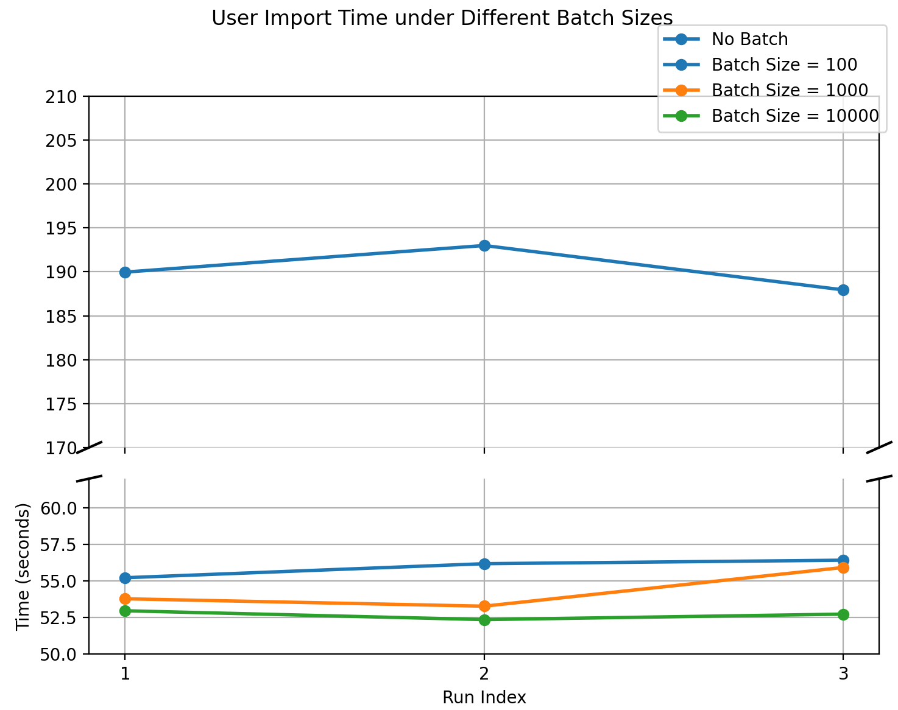
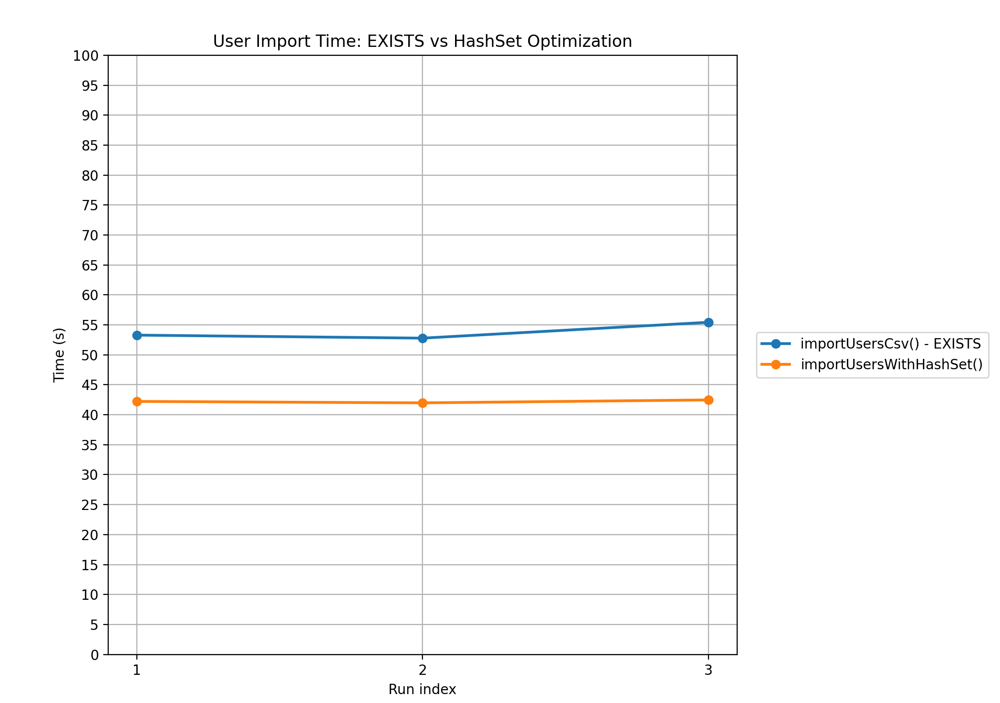

# **Report of Task 3**

> draft 1024 liyunzang
>
> update 1114
>
> update advanced part 1115

​	In this task, I implemented a Java program to import data from CSV files into the database designed in Task 2.

### **Prerequisites**

1. The database tables must already exist before running this script. (We will discuss a possible automated creation approach in the advanced part.)

2. The PostgreSQL **JDBC driver** must be added as a **project dependency**.

   In IntelliJ IDEA: open *File → Project Structure → Modules → Dependencies*, and add the JAR file `postgresql-42.2.5.jar`. The JAR file will be provided in the project directory.

### Code Execution Steps

#### **Step 1. Connect to the database**

In the `getConnection()` method, the class `org.postgresql.Driver` is loaded to establish a connection to the local PostgreSQL server.
The method uses the basic connection parameters — host, database name, user, password, and port — to build the JDBC URL and call `DriverManager.getConnection()`.
Once the dependency is correctly imported, the driver initializes the connection channel using the PostgreSQL protocol; otherwise, the connection attempt will fail. So please you have down import dependency properly in the prerequisites part.

#### **Step 2. Read data from CSV files**
The import program reads each CSV file using a lightweight line-based method. In `readOneCsvRecord()`, a `BufferedReader` retrieves one physical line at a time; empty lines are skipped, and `null` indicates the end of file.

After a complete line is obtained, the `splitCsvRecord()` method converts it into an array of fields. Instead of using `String.split(",")`, the method scans the line character by character. A boolean flag tracks whether the parser is currently inside quotation marks. Commas outside quotes are treated as field separators, while text inside quotes—including commas and escaped quotes—is preserved. This ensures that fields containing punctuation or quotation marks are handled safely.

Once the row is split, the program uses a small set of helper utilities to interpret the raw strings:

// 这里可简要介绍一下工具类方法，看最后的篇幅吧，如果偏少了就写一写

These parsing steps standardize the incoming data and separate generic CSV handling from table-specific logic. All import methods in Step 3 reuse this shared parsing pipeline before converting the processed values into batched SQL insertions.

#### **Step 3. Import data**

##### 3.1 Import `users.csv`

The `importUsersCsv()` method reads the users information from *users.csv* and inserts it into the `users` table and the corresponding `following` relationship table.

After obtaining a parsed CSV record from Step 2, the program extracts fields such as AuthorId, AuthorName, Gender, Age, and the follower/following lists. The follower and following lists are parsed into individual user-to-user relations, which are then inserted into the `following` table.

A parameterized `PreparedStatement` is used for both tables to accelerate. For every valid record, parameters are assigned and inserted via `addBatch()`. Invalid IDs and malformed list fields are skipped to avoid insertion errors. When the batch size limit is reached, the statements are executed together using `executeBatch()`.

##### **3.2 Import `recipes.csv`**

The `importRecipesCsv()` method processes the complex *recipes.csv* file by distributing different fields into multiple tables according to the schema in Task 2.

A single recipe record is decomposed and inserted into the following tables:`recipes` ，`nutrition`，`recipe_time`，`recipe_keyword`，`recipe_ingredient`，`recipe_instruction`，`recipe_favorite`, `keyword` and `ingredient`.Each table uses its own PreparedStatement.
Time-related fields (PrepTime, CookTime, TotalTime) are converted  into SQL TIME values. The DatePublished field is parsed into DATE format with fallback handling for missing or invalid values.

For multi-value fields such as Keywords, Ingredients, Instructions, and Favorites, the program splits the string into lists and inserts each item into its corresponding relationship table. Keywords and ingredients are also inserted into their dictionary tables (`keyword`, `ingredient`) with `ON CONFLICT DO NOTHING` to guarantee uniqueness.

Invalid recipe IDs, empty fields, or unparseable values result in skipping that specific part or the entire record, depending on severity.

Similarly, For every valid record, parameters are assigned and inserted via `addBatch()`.  When the batch size limit is reached, the statements are executed together using `executeBatch()`.

##### **3.3 Import `reviews.csv`**

The `importReviewsCsv()` method loads review data from *reviews.csv* and inserts it into `reviews` and`likes_relationship`.

Each CSV record is parsed into ReviewId, RecipeId, UserId, Rating, Review text, submission date, modification date, and Likes.

Since the database specifies `rating` as NOT NULL, any record with missing or invalid rating values is skipped.
 Date fields are parsed into DATE type with safe null handling.

The Likes field is split and inserted as multiple rows into `likes_relationship`. Duplicate likes and invalid user IDs are automatically filtered using `ON CONFLICT DO NOTHING`.`PreparedStatement` batching is applied here as well to maintain fast insertion speed for the large review dataset.

##### 3.4 Conclusion of import data

Here's the conclusion table for csv files, import method and the corressponding tables :

| CSV File      | Import Method        | Affected Tables                                              |
| ------------- | -------------------- | ------------------------------------------------------------ |
| `users.csv`   | `importUsersCsv()`   | users, following                                             |
| `recipes.csv` | `importRecipesCsv()` | recipes, nutrition, recipe_time, recipe_keyword, recipe_ingredient, recipe_instruction, recipe_favorite, keyword, ingredient |
| `reviews.csv` | `importReviewsCsv()` | reviews, likes_relationship                                  |

This modular, table-aware import pipeline ensures correctness, clarity, and efficiency when handling all three large CSV files.


#### **Step 4.Check the import correctness**

After the data import process completed successfully, I verified the correctness by counting the total number of records in each entity table using SQL `COUNT(*)` queries to find the result table.

```postgresql
-- counting the total number of records statements
SELECT 'users'               AS table, COUNT(*) FROM users
UNION ALL
SELECT 'following'           AS table, COUNT(*) FROM following
UNION ALL
SELECT 'recipes'             AS table, COUNT(*) FROM recipes
UNION ALL
SELECT 'recipe_time'         AS table, COUNT(*) FROM recipe_time
UNION ALL
SELECT 'nutrition'           AS table, COUNT(*) FROM nutrition
UNION ALL
SELECT 'reviews'             AS table, COUNT(*) FROM reviews
UNION ALL
SELECT 'likes_relationship'  AS table, COUNT(*) FROM likes_relationship
UNION ALL
SELECT 'keyword'             AS table, COUNT(*) FROM keyword
UNION ALL
SELECT 'ingredient'          AS table, COUNT(*) FROM ingredient
UNION ALL
SELECT 'recipe_keyword'      AS table, COUNT(*) FROM recipe_keyword
UNION ALL
SELECT 'recipe_ingredient'   AS table, COUNT(*) FROM recipe_ingredient
UNION ALL
SELECT 'recipe_favorite'     AS table, COUNT(*) FROM recipe_favorite
UNION ALL
SELECT 'recipe_instruction'  AS table, COUNT(*) FROM recipe_instruction;
```

The results are as follows:

| Table name           | Number of records (rows)              |
| -------------------- | ------------------------------------- |
| `users`              | 299,900                               |
| `following`          | 2,365,946                             |
| `recipes`            | 522,517                               |
| `recipe_time`        | 522,517                               |
| `nutrition`          | 486,050                               |
| `reviews`            | 1,401,963 (可能有问题需要doublecheck) |
| `like-relationship`  | 4,995,784                             |
| `keyword`            | 309                                   |
| `ingredient`         | 7215                                  |
| `recipe_keyword`     | 2,313,507                             |
| `recipe_ingredient`  | 3,711,214                             |
| `recipe_favorite`    | 1,252,050                             |
| `recipe_instruction` | 1,134,831                             |

These numbers in the main tables are consistent with the line counts of the original CSV files, indicating that the csv data have been successfully imported without loss or duplication.


### Advanced Part 

My test environment are shown below.

> CPU: AMD Ryzen 7 8745H (8 cores/16threads, with Radeon 780M Graphics)
>
> RAM size: 24GB
>
> DBMS: PostgreSQL 17.6 on x86_64-windows, compiled by msvc-19.44.35213, 64-bit
>
> Programming language:  Java SE 23.0.2 (64-bit)
>
> Compiler: Oracle JDK 23.0.2 (64-bit)
>
> Operating System: Windows 11 Home Chinese Edition, Version 24H2
>
> Database IDE version: DataGrip 2025.1.3
>
> Programming IDE version: IntelliJ IDEA 2024.3.3 (Ultimate Edition)

##### 1、Comparative Evaluation of Multiple Data Import Strategies

In the data importing part, I use some techniques to load data. In this part, I will try different strategies to evaluate the differences between import methods. Since the data source is large-scale, I will change the batch size and the use of preparedStatement to find their impact on the import time and programming efficiency.

In order to measure the import time in a constant way, I use a new class `StopWatch` to measure the execution time of program. When the import process starts, the timer records the start timestamp, and it records the end timestamp when the import finishes. Finally, it will calculate the time used and print it into console, so that we can get the experiment data. This method is stable and efficient, and it minimizes the influence of initialization and I/O on the timing results.

Note that some importing methods may quite time-consuming, so I only test on the `users.csv` file to compare the time.

**The first group of experiments** focuses on batching techniques. I tried different method of a series of changing batch size, including a "NO BATCH" version, which means each line is inserted into the table individually. I execute every batch size seperately, and record the time they used. Repeat this procedure for 3 times to avoid some random disturb. The results are shown in the following table:(这里可以把每次实验的截图放在附件？)

| Method                         | Batch size | Average time | comparision   |
| ------------------------------ | ---------- | ------------ | ------------- |
| importUsersCsvNoBatch()        | NO         | 190.307s     | 1×            |
| importUsersCsvWith100Batch()   | 100 rows   | 55.947s      | 3.402x faster |
| importUsersCsvWith1000Batch()  | 1000 rows  | 53.836s      | 3.535x faster |
| importUsersCsvWith10000Batch() | 10000 rows | 51.693s      | 3.681x faster |

And here is the picture for each runtime:




The results of the group of experiments demonstrate the importance of the batching technique in the data importing process. When batching is disabled, the import procedure becomes significantly slower, taking almost 3.5 times longer than the batched versions. When batching is enabled, the import process complete in roughly the same time, with only small improvement as the batch size increases.Therefore, the conclusion is that: **The batch technique is important and efficiency-friendly in large-scale data importing. Once a reasonable batch size is chosen and rows are grouped together, the size will not affect importing time significantly.**

The reason behind it is clearly to understand: Batching allows multiple insert operations to be grouped into a single request, which reduces communication overhead, minimizes repeated SQL parsing, and lowers the number of round-trip interactions with the database engine. So the import process becomes much more efficient as soon as batching is introduced.

**The second group of experiments** focuses on the use of `PreparedStatement`.  In this part, I tried two importing  strategies: one using `PreparedStatement` with a preprocessing SQL sentence, the other straightforward constructs row SQL statement for each row. The only difference between two methods is the SQL construction method, and other factors stay the same. These experiments are repeated for 3 times to reduce disturb and finally calculate the result, which is shown in the following table:

| Method                                | Type              | Average time | Comparison    |
| ------------------------------------- | ----------------- | ------------ | ------------- |
| importUsersWithoutPreparedStatement() | Statement         | 182.149s     | 1×            |
| importUsersCsv()                      | PreparedStatement | 53.836s      | 3.383× faster |

And here is the picture for each runtime:


The results clearly show that the use of `PreparedStatement` brings a improvement in import speed and efficiency. When raw SQL strings are executed directly, the import becomes much slower because the database must parse and optimize every command separately. In contrast, the prepared version finishes in significantly less time and shows much more stable performance across repeated trials. Therefore, the conclusion is that **PreparedStatement technique is crucial for efficient large-scale imports, and removing it leads to performance degradation.**


#### 2.optimize import efficiency

Since we've choose a suitable batch size and apply preparedStatement in the initial import version, the following part will focus on the optimization in efficiency improvement.

In the original version, we use `EXISTS` keyword in the preparedStatement to check the existance of users, and then insert the following relationship, so that the foreign key won't conflict. This method is safe but might be time-consuming. In order to optimize the importing script, we must find a new way to double-check the existance.

The target is to find users in a list, so the suitable data structure is `HashSet` or `HashMap`. We rewrite the `importUsersCsv` method, using simple `String SQL_FOLLOW` statement and leave the existance checkness to the Java edge. After that, in the stage of inserting to the `following` table, we read all the authorId from database, and store them in a hashSet. Finally, before the batch is executed, we only check whether the hashSet contains the certain user, instead of check them in the SQL statement. We use the batch size of 1000 rows and the other condition stay the same as comparsion version (previously mentioned, with the average time of 53.836 seconds). These experiments are repeated for 3 times to reduce disturb and finally calculate the result, which is shown in the following table:

| Method                   | Type                   | Average time | Comparison    |
| ------------------------ | ---------------------- | ------------ | ------------- |
| importUsersCsv()         | Use SQL EXISTS keyword | 53.836s      | 1x            |
| importUsersWithHashSet() | use HashSet            | 42.228s      | 1.275× faster |

And here is the picture for each runtime:



The results demostrate that replacing SQL `EXISTS` checks with an Java `HashSet` significantly improves the user import procedure. The original method using SQL `EXISTS` required an average of **53.836 seconds**, while the optimized version using `HashSet` took only **42.228 seconds** on average. This corresponds to an improvement of approximately **27%**.

The reason why this optimization works is checking foreign-key existence through SQL `EXISTS` requires PostgreSQL to do subqueries repeatedly. These repeat procedure significantly slow down the importing process. However, loading all valid user IDs into a Java `HashSet` allows each existence check to be completed in constant time **without contacting  to the database**. What's more, the application of hashSet filtered the redundency before insertion, which prevents unnecessary SQL statements from being executed. These factors result in observed approximately 27% improvement in overall import performance.
